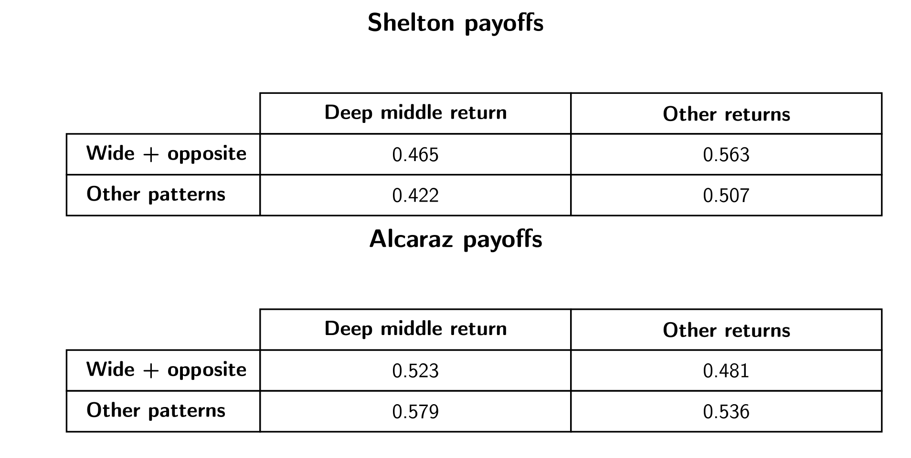
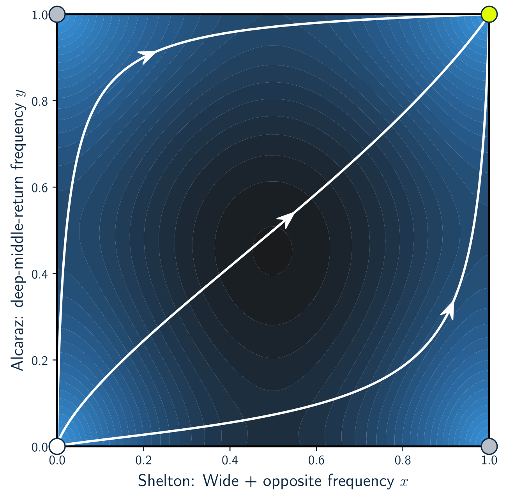
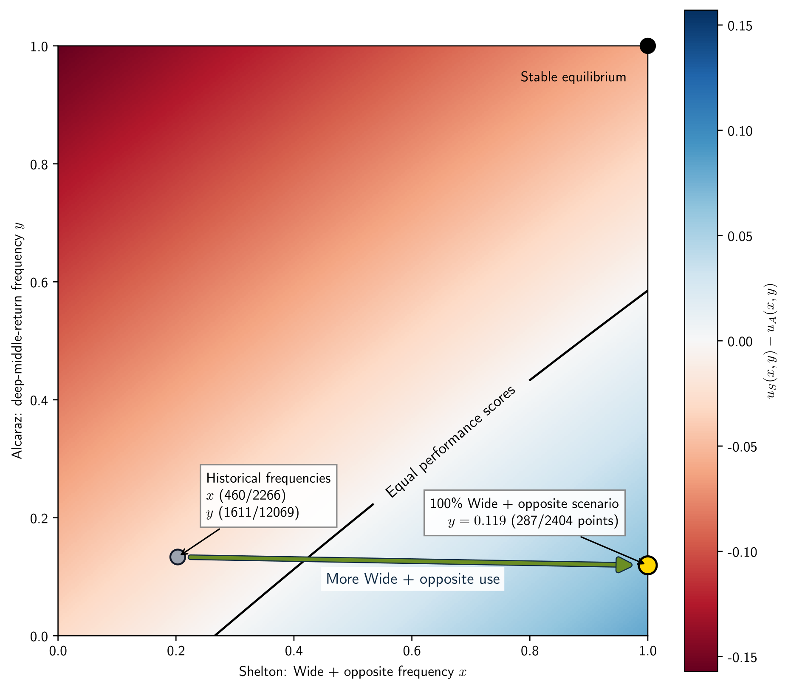

# Shelton–Alcaraz: tennis tactics through data and game theory

[](https://mybinder.org/v2/gh/SlimaneD/Shelton-Alcaraz-USOpen26/main?labpath=SheltonAlcaraz.ipynb)
[](https://colab.research.google.com/github/SlimaneD/Shelton-Alcaraz-USOpen26/blob/main/SheltonAlcaraz.ipynb)

Can Ben Shelton gain an advantage by serving wide and sending his serve+1 to the
opposite side? This project combines point-by-point tennis data with an exploratory
two-player game to study that question against Carlos Alcaraz.

**Wide + opposite** means that Shelton serves wide, the return lands in play, and
his serve+1 goes to the opposite side of the court.

Among Shelton's charted service points with a return in play, the descriptive results
were:

- Wide + opposite: **57.4% won** (`n = 526`)
- Wide + elsewhere: **47.3% won** (`n = 537`)
- Non-wide: **50.2% won** (`n = 1,448`)

These are historical associations rather than causal estimates. Wide + opposite can
only be observed when the return comes back and Shelton attempts a serve+1. Opponent,
surface, return quality, missing annotations, and execution difficulty can all affect
the comparison.

## Exploratory game

The model combines two historical samples:

- Shelton's point-win rates while serving against his charted opponents.
- Alcaraz's point-win rates while returning against his charted opponents.

The resulting payoffs are performance scores from different populations. They are not
complementary head-to-head probabilities and the figures are not a match forecast.
The replicator dynamics illustrate how tactical frequencies would change under a
specific payoff-comparison updating rule.







## Reproduce the analysis

The analysis requires Python 3.12 or later. For a local run, clone this repository,
create an environment, and open Jupyter:

```bash
git clone https://github.com/SlimaneD/Shelton-Alcaraz-USOpen26.git
cd Shelton-Alcaraz-USOpen26
python3.12 -m venv .venv
source .venv/bin/activate
pip install -r requirements.txt
jupyter lab
```

Run `SheltonAlcaraz.ipynb` from top to bottom. It contains the parser, feature
engineering, descriptive analysis, game construction, checks, and provenance record.
It uses portable Matplotlib defaults and does not require LaTeX or custom fonts. If a
Match Charting Project checkout is available beside this repository, the notebook uses
it. Otherwise, it downloads the two required CSV files from the pinned data revision.

The Binder and Colab badges above open the main notebook without a local installation.
Their first run downloads the required data and the tagged pynamo release, so it needs
an internet connection and may take a few minutes.

The optional `SheltonAlcaraz_publication_figures.ipynb` reads the tables exported by
the main notebook and recreates the three figures for publication. It requires
XeLaTeX and the CMU Sans Serif font files. Its typography dependency is deliberately
kept out of the reproducible analysis notebook.

Both notebooks use the tagged `v0.2.0` release of
[pynamo](https://github.com/SlimaneD/pynamo) from its official repository. The main
notebook records package versions, input-file hashes, and the local data revision at
the end of a successful run.

## Repository contents

| Path | Purpose |
| --- | --- |
| `SheltonAlcaraz.ipynb` | Complete reproducible analysis |
| `SheltonAlcaraz_publication_figures.ipynb` | Optional XeLaTeX/CMU figure rendering |
| `publication_figures/` | Portfolio-ready PNG and PDF figures |
| `requirements.txt` | Python environment used for validation |
| `environment.yml` | Python 3.12 Binder environment |
| `DATA_ATTRIBUTION.md` | Dataset attribution and license notice |

## Data and scope

This analysis uses **Crowdsourced shot-by-shot professional tennis data** by
[The Tennis Abstract Match Charting Project](http://www.tennisabstract.com/charting/meta.html),
obtained from its [GitHub repository](https://github.com/JeffSackmann/tennis_MatchChartingProject).
The dataset is licensed under
[CC BY-NC-SA 4.0](https://creativecommons.org/licenses/by-nc-sa/4.0/): attribution is
required, use is non-commercial, and adapted material must be shared under the same
license. See [`DATA_ATTRIBUTION.md`](DATA_ATTRIBUTION.md) for the complete notice used
by this project.

AI-assisted coding accelerated the exploration and notebook refactoring. The notebook
makes the parsing rules, sample definitions, assumptions, counts, and limitations
available for review.
